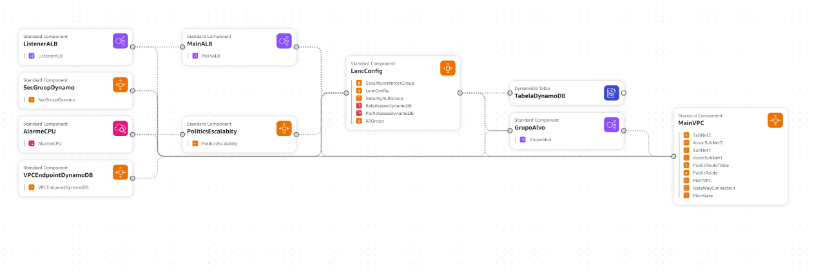

# Documentação Técnica do Projeto de Arquitetura AWS com CloudFormation

## Objetivo do Projeto
Provisionar uma arquitetura na AWS utilizando o CloudFormation, que englobe o uso de um Application Load Balancer (ALB), instâncias EC2 com Auto Scaling e um banco de dados DynamoDb.

## Diagrama da Arquitetura


## Infraestrutura do CloudFormation

### Visão Geral
A infraestrutura provisionada pelo template CloudFormation abrange a criação de uma Virtual Private Cloud (VPC) com subnets públicas, um Application Load Balancer (ALB), instâncias EC2 gerenciadas por um Auto Scaling Group, e um banco de dados DynamoDB. Essa configuração foi projetada para fornecer uma aplicação web escalável e altamente disponível.

### Componentes Principais

1. **VPC e Subnets**:
   - **MainVPC**: Uma VPC dedicada com um bloco CIDR de 10.0.0.0/16.
   - **SubNet1 e SubNet2**: Duas subnets públicas em zonas de disponibilidade diferentes (us-east-1a e us-east-1b) para alta disponibilidade.

2. **Internet Gateway e Rotas**:
   - **MainGate**: Um Internet Gateway para permitir a comunicação da VPC com a internet.
   - **PublicRouteTable e PublicRoute**: Uma tabela de rotas pública que direciona o tráfego para o Internet Gateway.

3. **Security Groups**:
   - **SecurityInstancesGroup**: Um grupo de segurança para as instâncias EC2 que permite tráfego SSH (porta 22), HTTP (porta 80), HTTPS (porta 443) e na porta específica da aplicação (porta 5000).
   - **SecurityALBGroup**: Um grupo de segurança para o ALB que permite tráfego HTTP (porta 80).

4. **Auto Scaling Group e Launch Configuration**:
   - **LancConfig**: A configuração de lançamento que define a AMI, tipo de instância, par de chaves SSH, grupos de segurança e script de inicialização.
   - **ASGroup**: Um Auto Scaling Group que gerencia a escala das instâncias EC2 entre 2 e 7 instâncias, dependendo da demanda.

5. **Application Load Balancer (ALB)**:
   - **MainALB**: Um ALB que distribui o tráfego de entrada entre as instâncias EC2.
   - **ListenerALB**: Um listener que encaminha o tráfego HTTP (porta 80) para o grupo de destino.
   - **GrupoAlvo**: Um grupo de destino que associa as instâncias EC2 ao ALB e realiza verificações de saúde (health checks).

6. **DynamoDB**:
   - **TabelaDynamoDB**: Uma tabela DynamoDB usada pela aplicação para armazenar dados.
   - **SecGruopDynamo**: Um grupo de segurança para o DynamoDB que permite conexões das instâncias EC2.
   - **VPCEndpointDynamoDB**: Um endpoint VPC para acessar o DynamoDB de forma privada.

7. **IAM Roles e Instance Profile**:
   - **RoleAcessoDynamoDB**: Uma role IAM que permite que as instâncias EC2 acessem o DynamoDB.
   - **PerfilAcessoDynamoDB**: Um perfil de instância associado à role IAM.

### Decisões Técnicas

1. **VPC e Subnets**:
   - **Decisão**: Criar uma VPC dedicada com duas subnets públicas em diferentes zonas de disponibilidade (us-east-1a e us-east-1b).
   - **Justificativa**: Garantir alta disponibilidade e redundância geográfica, permitindo que a aplicação continue funcionando mesmo se uma das zonas de disponibilidade falhar. Subnets públicas foram escolhidas para permitir a exposição das instâncias EC2 diretamente à internet, facilitando o acesso ao serviço.

2. **Internet Gateway e Roteamento**:
   - **Decisão**: Implementar um Internet Gateway e configurar rotas públicas.
   - **Justificativa**: Necessário para permitir que as instâncias EC2 e o Application Load Balancer (ALB) possam receber tráfego de entrada da internet e enviar tráfego de saída para a internet. Isso é fundamental para uma aplicação web que deve estar acessível publicamente.

3. **Security Groups**:
   - **Decisão**: Configurar grupos de segurança para o ALB e para as instâncias EC2, especificando regras de ingresso e saída.
   - **Justificativa**: Garantir a segurança e o controle de acesso aos recursos, permitindo apenas o tráfego necessário. Por exemplo, o grupo de segurança do ALB permite tráfego HTTP na porta 80 de qualquer IP, enquanto o grupo de segurança das instâncias EC2 permite tráfego SSH (porta 22) para administração, HTTP (porta 80) para acesso web, HTTPS (porta 443) e uma porta específica para a aplicação Flask (porta 5000).

4. **Auto Scaling Group e Launch Configuration**:
   - **Decisão**: Utilizar um Auto Scaling Group com uma Launch Configuration que define a AMI, tipo de instância, par de chaves SSH e script de inicialização.
   - **Justificativa**: Permitir que a arquitetura escale automaticamente a quantidade de instâncias EC2 com base na demanda de tráfego, garantindo desempenho e disponibilidade. A Launch Configuration permite que todas as instâncias sejam configuradas de forma consistente e inicializadas com os mesmos parâmetros e scripts.

5. **Application Load Balancer (ALB)**:
   - **Decisão**: Implementar um ALB para distribuir o tráfego entre as instâncias EC2 e configurar listeners e target groups para gerenciar o tráfego.
   - **Justificativa**: Melhorar a distribuição de carga e a resiliência do serviço, garantindo que o tráfego seja balanceado entre várias instâncias EC2. Isso ajuda a evitar sobrecarga em uma única instância e melhora a tolerância a falhas.

6. **DynamoDB**:
   - **Decisão**: Utilizar o DynamoDB como banco de dados NoSQL para armazenar os dados da aplicação.
   - **Justificativa**: O DynamoDB é um serviço de banco de dados gerenciado, escalável e altamente disponível, que se integra facilmente com outros serviços da AWS. Ele permite escalabilidade automática e oferece desempenho consistente, o que é ideal para aplicações que necessitam de alta disponibilidade e baixa latência.

7. **Escolha da Região us-east-1**:
   - **Decisão**: Implementar a infraestrutura na região us-east-1 (Norte da Virgínia).
   - **Justificativa**: A região us-east-1 é uma das mais antigas e populares da AWS, oferecendo uma ampla gama de serviços e capacidade. Ela frequentemente possui os preços mais baixos e novas funcionalidades são geralmente lançadas primeiro nessa região. Além disso, sua localização geográfica é estratégica para minimizar a latência para usuários na costa leste dos Estados Unidos e regiões adjacentes.

## Estemativa de Preço


## Conclusão
A infraestrutura provisionada com o CloudFormation fornece uma solução escalável e altamente disponível para hospedar uma aplicação web. Utilizando serviços gerenciados da AWS como EC2, ALB e DynamoDB, a arquitetura garante alta disponibilidade, segurança e desempenho. Através de práticas recomendadas e otimizações, é possível reduzir significativamente os custos operacionais. A escolha da região us-east-1 foi estratégica para aproveitar a ampla gama de serviços, menor latência e custos reduzidos. Implementar essa arquitetura seguindo o guia passo a passo garante que todos os componentes sejam configurados corretamente e estejam prontos para suportar cargas de trabalho de produção.

## Guia Passo a Passo

Instale o AWS CLI.

Com ele instalado rode as seguinte linha no terminal AWS:

```bash
aws ec2 create-key-pair --key-name ChaveCloud --query 'KeyMaterial' --output text > ChaveCloud.pem
```
Em Segundo:
```Bash
aws cloudformation create-stack --stack-name <NomeDaSuaStack> --template-body file://template.yaml --parameters ParameterKey=KeyName,ParameterValue=ChaveCloud --capabilities CAPABILITY_NAMED_IAM
```

Link para o repositorio: https://github.com/PedroHrc1/AplicacaoCloud